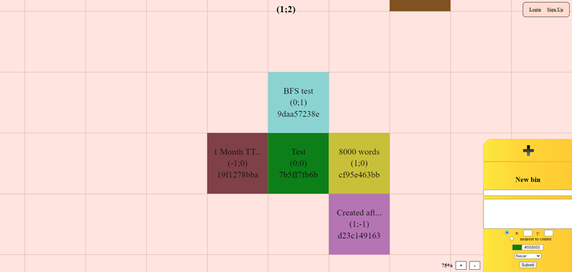
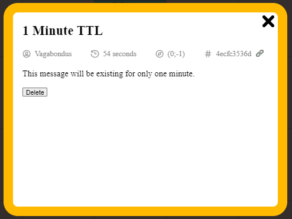
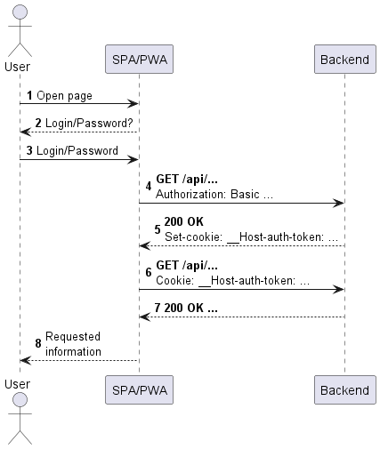
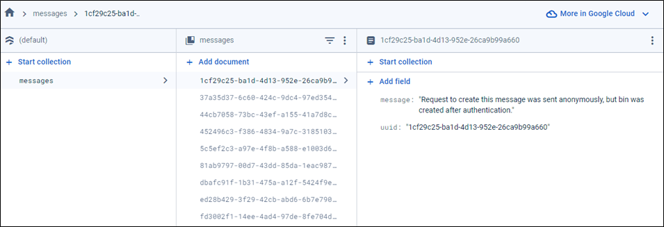
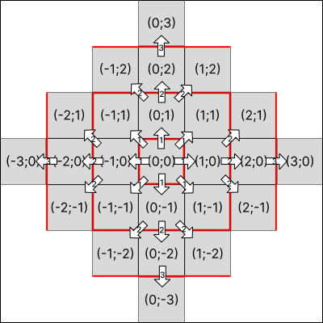

## GENERAL INFORMATION

Rethinking of the [pastebin.com](https://pastebin.com/) web app. The idea is simple: every user can create block of text which he wants to be shared with other people (friends, coworkers, etc.) or devices using short links. You can set the expiration date of your bin to ensure that content remains relevant and secure. This might be used to share code, large messages, link collections or just your thoughts.

### Project overview

The main difference between [pastebin.com](https://pastebin.com/) and this project is an interactive map that helps to visualize existing notes and to put them all into one place. The map is a 201x201 field, so it can maximum contain 40,401 bins. Each note on the map has its title, coordinates and unique identifier.



The whole map is available for every user so there is no privacy. Despite this, to create or delete note, you need to be authenticated.

There are several ways to create new bin:
1.	Click on the empty cell.
2.	Select coordinates manually.
3.	Select coordinates automatically (the cell closest to the center will be selected).



## FEATURES

### JWT authentication

To keep users authenticated and to avoid saving and maintaining sessions, the app uses JWT tokens. To store tokens safely, application uses secure cookies. Once user logs in, he gets an access token which contains information about its purpose, issue and expiration time, some user's data. It also has a special signature that is the result of hashing token fields with a private key contained in the application.yml file.

After a client makes request to the application, the server checks this token and its validity. If everything is okay, request is accepted. The token lives for 30 days and then becomes expired. If a user logs out, the cookie is deleted and JWT token is marked as expired.



### Temporary links

When a request to create a bin is received, server provides 10-character HEX hash that will be associated with this note. This is assumed to be the ID of the bin. The total number of all possible hashes is 16^10 = 1,099,511,627,776. To share the bin with others, users can copy the link that looks like this:
`https://pastebin.luxusxc.com/map?id=7b5ff7fb6b`.
After following the link user gets to the note.

During the creation of the bin, the user can select its time to live, which ranges between one minute and six months. If the time expires, the bin will be deleted, and the link will become invalid.

### Cloud storage

It is assumed that users should have the opportunity to save large text. Because of that, the application stores messages in Firebase Storage to reduce database load. When the server processes the bin creating request, it sends user's message to a Firestore and saves its UUID in the DB. If someone wants to receive information about a bin, the app just needs to get it back from the cloud service and add it to the user’s response.



### Determining the most appealing place

Bins placed nearer to the center are considered more attractive than others. From that point of view, a user should be able to leave his message as close as possible to the center without knowing anything about other bins. So there is an option in the drop-down menu to enable it automatically.

The app uses a breadth-first search algorithm to achieve that. Server gets all bin’s data, fills an inner array and then iterates over it starting from the center. Working with a queue that initially contains only the central cell, the app needs to check cell’s availability. If it is filled, it just adds adjoined cells to the queue. The cycle works until an empty cell appears.



### WebSockets support

To synchronize all actions performed with bins among users, the app uses websockets. When the application starts, it subscribes to the endpoint where notifications about the creation and deletion of bins are sent. After someone creates or deletes his message, every client receives this data and updates the map.

## HOW TO INSTALL THE PROJECT

The application requires the use of PostgreSQL. Therefore, there is a SQL script available that creates all the necessary tables, dependencies and constraints.

Additionally, the app requires certain settings and properties to be specified in either .properties or .yml file. Because of information security, this file was not provided, so user needs to create it by himself.

Example of application.yml

```
spring:
  mvc:
    hiddenmethod:
      filter:
        enabled: true
server:
  http2:
    enabled: true
  ssl:
    enabled: true
    key-store: ${ssl.keystore.path} # location of the .pfx file that contains ssl/tls certificate
    key-store-password: "" # password for PKCS12
    keyStoreType: PKCS12
  port: 8080
db:
  url: ""
  username: ""
  password: ""
  firebase-key-location: ${firebase.key.location} # location of the private firebase key
jwt:
  cookie-token-key: '{"kty":"oct","k":""}' # token used for creating cookie signature
  ```

To start an application on your machine, just build the project with Maven and then execute the generated JAR file. Please note that these actions require specifying the locations of the keystore and Firebase key.

  ```
  mvn clean package -Dssl.keystore.path=path/of/keystore -Dfirebase.key.location=path/of/firebaseKey
java -jar -Dssl.keystore.path=path/of/keystore -Dfirebase.key.location=path/of/firebaseKey pastebin.jar
```